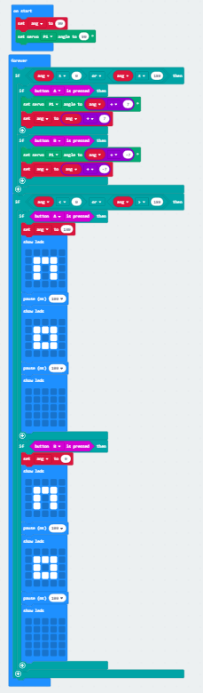

# Microbit

Initially, my group worked using the Microbit hardware, which turned out to be very frustrating. Downloading issues prevented us from working on our actual code for quite some time. Once everything was working, we started to experiment with the code. We managed to get the servo to move on the button presses, using some help from other classmates, but it was very choppy. The angle would go past 0 or 180, which was very satisfying. We tried different values, loops, etc. but nothing worked. After a while of trial and error, we figured out that showing LEDs was what slowed down the code. The Microbit had to pause to show the LEDs before moving on to the next movement. Once we took them out, everything worked seamlessly. We wanted to experiment with radio signals in the emulator, but the "tilt" function couldn't be simulated so we left it at that. Overall, I learned a lot about communication and signals that I'll be able to implement into future projects.
